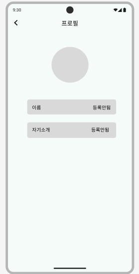
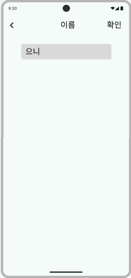

# TODO 앱 구현

## 기술 조건
1. Flutter version 3.29.0 이상 
2. Android 플랫폼

### 기능
1. 사용자 정보 등록
2. Todo List
   - 삭제 [ ]
   - 필터 [ ]
   - 검색 [ ]
3. Todo 상세
   - 삭제 [ ]
   - 수정 [ ]
4. Todo 추가
   - 임시저장 [ ]

#### 개발 분석 노트
> UI

- 공통 Scaffold 생성 
  - 필수 : SafeArea, 바깥 여백
  - 옵션 : AppBar 설정, child 위젯
1. 사용자 정보 등록 페이지
 
   - 사용자 이름이나 자기소개 클릭 시, 프로필 설정 화면으로 이동
   - AppBar 추가
   - Column 으로 배치, Padding으로 여백 
   - 이름, 자기소개 컨테이너 클릭 시 설정할 수 있는 페이지로 이동
   - 이름은 30자, 자기소개는 50자 제한 
   - 이름과 자기소개 변경 후 확인 클릭 시 설정 변경
   - 프로필 사진 업로드 기능 공부 필요!
   - Container 공통 위젯으로 묶기
  